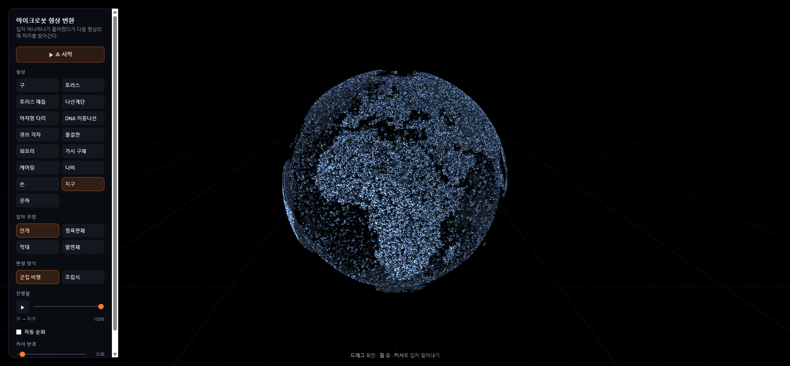

# microbot-morph

빅 히어로 6의 마이크로봇 장면에서 영감을 받은 3D 입자 변환 데모.
65,536개의 입자가 형상 사이를 오가며 재조립되고, **그 변형 과정 자체가
눈에 보이도록** 만든 것이 목표다.



## 실행

ES module을 쓰므로 `file://`로 직접 열면 동작하지 않는다. 정적 서버가 필요하다.

```bash
python -m http.server 8765
# http://127.0.0.1:8765
```

빌드 단계는 없다. three.js만 CDN에서 가져오고 나머지는 전부 이 저장소 안에 있다.

## 조작

| 조작 | 동작 |
|---|---|
| 형상 버튼 | 해당 형상으로 변형. 변형 중이면 큐에 들어가 이어서 실행된다 |
| 군집 비행 / 조립식 | 입자가 출발하는 순서를 바꾼다 |
| 진행률 슬라이더 | 마지막 변형을 0~100% 사이에서 자유롭게 되감는다 |
| 커서 반경 슬라이더 | 커서가 밀어내는 범위. 기본 0.22, 범위 0.08~0.75 |
| 드래그 | 궤도 회전 |
| 휠 / 핀치 | 줌 |
| 커서 | 겹쳐 보이는 입자를 밀어낸다. 커서가 떠나면 제자리로 돌아온다 |

페이지를 열면 사방에 흩어진 입자가 몰려와 첫 형상을 조립하는 **오프닝**이
재생된다. 카메라도 함께 밀고 들어온다.

변형은 **중간에서 저절로 느려졌다가** 끝에서 다시 빨라진다. 가장 볼 만한
구간이 입자가 날고 있는 중간인데 등속으로 두면 1초 남짓에 지나가 버린다.

## 구조

```
index.html        importmap, 캔버스, UI 마크업
src/shapes.js     형상 생성기 (순수 함수, three.js 비의존)
src/delayModes.js 군집 비행 / 조립식 시차 함수
src/particles.js  Points 지오메트리 + 커스텀 셰이더
src/morph.js      전이 상태, 큐, 자동 순회
src/postfx.js     잔상 누적 및 합성
src/controls.js   궤도 카메라, 커서 광선
src/pointer.js    커서 반발 스프링
src/ui.js         패널
src/main.js       씬 조립, 렌더 루프
```

핵심 설계는 **셰이더 보간**이다. 입자마다 출발 좌표 A와 도착 좌표 B를 GPU에
올려두고, 매 프레임 진행률 `uT` 하나만 넘긴다. 위치 계산은 전부 vertex
shader가 한다. 상태가 누적되지 않으므로 스크러버(자유 되감기)가 `uT`를
슬라이더에 연결하는 것만으로 구현된다.

자세한 설계 근거와 기각한 대안은
[docs/superpowers/specs/2026-09-19-microbot-morph-design.md](docs/superpowers/specs/2026-09-19-microbot-morph-design.md)
에 있다.

## 테스트

```bash
node --test test/shapes.test.js
```

`shapes.js`는 three.js에 의존하지 않는 순수 함수라 Node에서 그대로 검증된다.
점 개수 일치, NaN 부재, 정규화 반경, bbox 중심, 결정성, Morton 정렬 효과를
확인한다.

## 라이선스

MIT
